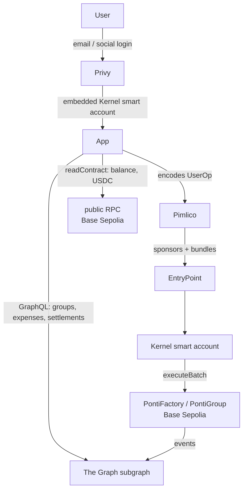

# ponti

> Settle up, on-chain.

[](https://github.com/aliersh/ponti/actions/workflows/test.yml)
[](contracts/foundry.toml)
[](https://getfoundry.sh)
[](https://sepolia.basescan.org)
[](https://sepolia.basescan.org/address/0x17463e06C303e30044609a9a412d7DB4746Cb210)
[](LICENSE)

Ponti is a non-custodial primitive for shared expenses between two people. They deploy a group contract together, record expenses against it, and settle the running balance in USDC directly between their wallets, on-chain, with no third party holding funds in between.

It's a full-stack monorepo: Solidity contracts (the source of truth), a React app that makes the contract usable without crypto knowledge (email login, an embedded smart account, gas sponsored via ERC-4337), and a subgraph that serves the reads.

## Status

**Proof of concept: complete and frozen.** Ponti was built to demonstrate non-custodial, on-chain expense settlement end to end. M1 (the contract) and M2 (the gasless onboarding app) are both complete on Base Sepolia testnet. The project is not under active development; the later milestones below were scoped during design and deliberately not pursued.

M1 is deployed and verified on Base Sepolia, `PontiFactory` at [`0x1746…Cb210`](https://sepolia.basescan.org/address/0x17463e06C303e30044609a9a412d7DB4746Cb210). M2 works end to end: create a group, add/edit/delete expenses, and settle, all gasless. **[Live demo](DEMO_URL)**, running on Base Sepolia testnet.

## How it works

1. Two people deploy a Ponti group together: one smart contract, one address, just for them.
2. Either person can record a shared expense at any time. The contract updates a single net balance. No money moves yet.
3. Expenses can be edited or deleted. The contract recomputes the balance accordingly. A full audit trail is preserved on-chain.
4. When the debtor wants to settle up, they call `settle()`. A single transaction approves exactly the amount owed and moves it from the debtor's wallet to the creditor's wallet, then resets the balance to zero, with no standing allowance and no funds ever held by the contract.

## How it's built



The contract is the source of truth; everything off-chain is plumbing on top of a contract that works standalone.

- **Writes** are sponsored UserOperations (ERC-4337): email login creates an embedded Kernel smart account, the first write deploys it, and Pimlico sponsors gas, so the user never holds ETH or a seed phrase.
- **Settlement** batches a USDC `approve` for the exact debt and the `settle()` call into one `executeBatch`. Funds move debtor to creditor via `safeTransferFrom`, and the contract never holds a balance.
- **Reads** split between a The Graph subgraph (lists and history; dynamic data-source templates handle the per-group contracts deployed at runtime) and direct `readContract` calls (balances). After a write, the app waits for the subgraph to index the new block before refreshing, and degrades honestly if the indexer lags.
- **Contracts** are tested with Foundry (unit, fuzz, invariant, and fork tests) and verified on Basescan.

For the full picture (component map, data flows, and the decision log) see [`docs/architecture.md`](docs/architecture.md).

## Known limitations

Ponti is a proof of concept; its scope was deliberately bounded.

**Product**

- Expenses split 50/50 only. Custom ratios would require a contract change.
- Two members per group. Multi-party groups were scoped but not built.
- USDC only. No other tokens or fiat.
- Names are stored per-device, in the browser, and not synced. This is a deliberate choice to avoid running a backend; the same address can show a different name on another device.
- You add someone by pasting their address. There are no QR codes or invite links.
- No fiat on-ramp or off-ramp. "Add funds" links to a testnet faucet, and there is no cash-out path (real on/off-ramps are mainnet-only).

**Technical**

- Testnet only (Base Sepolia), and not audited. Do not use with real funds.
- Reads come from a free-tier hosted subgraph that can lag or stall. When it does, the app says so plainly and balances stay correct, since they are read straight from the contract.

## Repo layout

| Directory | Contents |
| --- | --- |
| `contracts/` | Solidity contracts, Foundry test suite, deployment scripts |
| `app/` | Vite + React SPA, the M2 onboarding layer |
| `subgraph/` | The Graph subgraph (AssemblyScript mappings, schema, deploy config) |
| `docs/` | Design rationale, architecture, and per-component specs |

## Getting started

### Contracts

Ponti is built with [Foundry](https://getfoundry.sh).

```bash
git clone https://github.com/aliersh/ponti.git
cd ponti/contracts
forge install   # fetches the forge-std and openzeppelin-contracts submodules
forge build
forge test
```

Most of the suite (unit, fuzz, and invariant tests) runs with no configuration. The fork tests run against Base Sepolia and read the `BASE_SEPOLIA_RPC_URL` environment variable; set it in a `contracts/.env` file to run them.

### App

```bash
cd ponti/app
pnpm install
pnpm gen:abi   # generates app/src/generated/contracts.ts from Foundry build artifacts
pnpm dev
```

Required environment variables (copy `app/.env.example` to `app/.env`):

| Variable | Where to get it |
| --- | --- |
| `VITE_PRIVY_APP_ID` | [Privy dashboard](https://dashboard.privy.io), public, safe in the client bundle |
| `VITE_SUBGRAPH_URL` | the Ponti subgraph's GraphQL query endpoint |
| `VITE_PIMLICO_SPONSORSHIP_POLICY_ID` | Pimlico dashboard, optional; leave empty if not required by your policy |
| `VITE_RPC_URL` | optional, overrides the default Base Sepolia public RPC for `readContract` calls |

### Subgraph

Built with `graph-cli` (`pnpm build` from `subgraph/`) and deployed to [Goldsky](https://goldsky.com). See [`docs/subgraph-spec.md`](docs/subgraph-spec.md) for the entity schema and query design.

## Documentation

- [`docs/architecture.md`](docs/architecture.md): the system architecture, component map, data flows, and decision log
- [`docs/design.md`](docs/design.md): the design and the reasoning behind it
- [`docs/contract-spec.md`](docs/contract-spec.md): the contract's function-by-function specification
- [`docs/app-spec.md`](docs/app-spec.md): the web app specification (flows and integration)
- [`docs/subgraph-spec.md`](docs/subgraph-spec.md): the indexer (The Graph subgraph) specification

## Security

Ponti is deployed to testnet (Base Sepolia) only and has not been audited. **Do not use it with real funds.** The contract is non-custodial by design: it never holds funds, and settlement moves USDC directly between members' wallets. That property has not been independently reviewed.

## What was built, and what wasn't

A proof of concept, not a maintained product. M1 and M2 were completed; the later milestones were scoped during design but deliberately not pursued.

| Milestone | Theme | Outcome |
| --- | --- | --- |
| **M1** | Two-party non-custodial IOU contract | Complete (deployed and verified, Base Sepolia) |
| **M2** | Embedded smart-account auth, gasless UX (Base Sepolia) | Complete (functional end to end) |
| **M3** | Multi-party groups and debt-graph simplification | Scoped, not pursued |
| **M4** | Off-chain integration: bank-feed ingestion | Scoped, not pursued |

See [`docs/design.md`](docs/design.md) for the reasoning behind the milestone ordering.

## About

Built by [Ariel Diaz](https://github.com/aliersh).

## License

[MIT](LICENSE).
