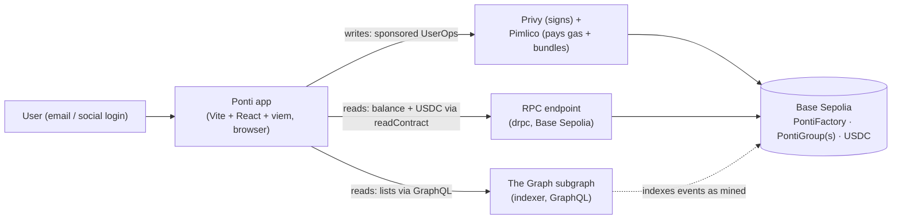
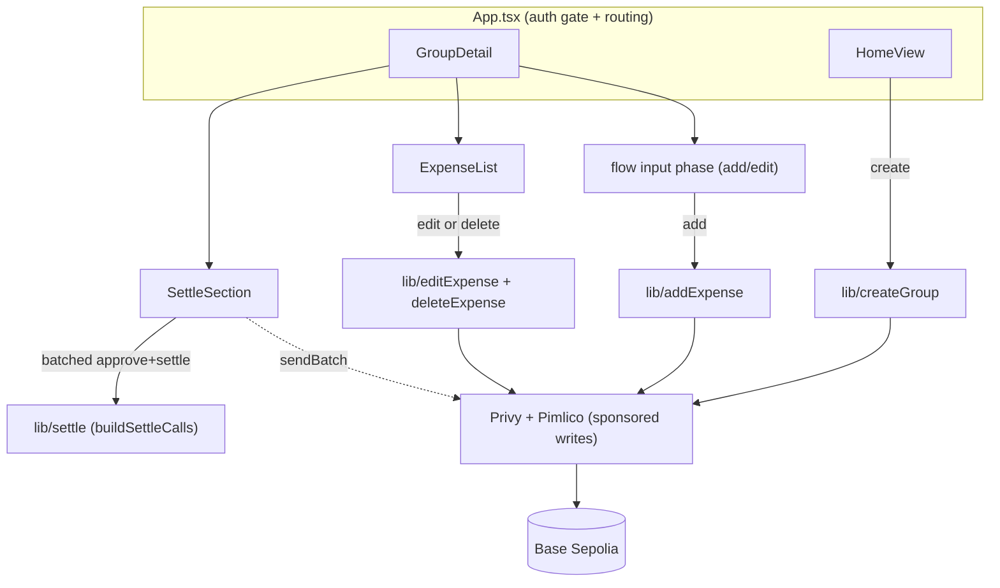
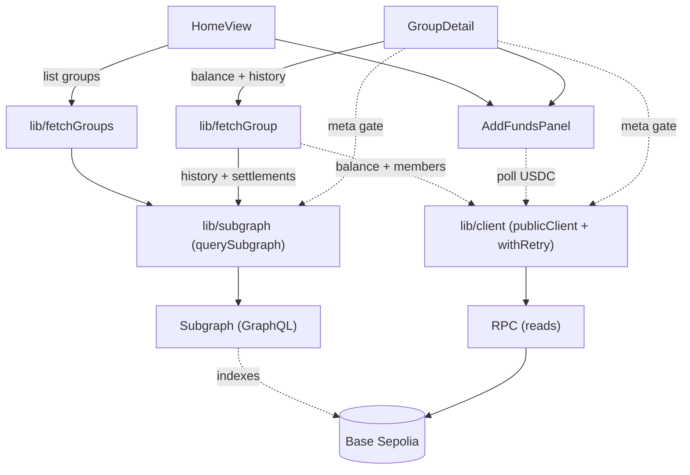
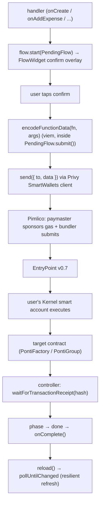
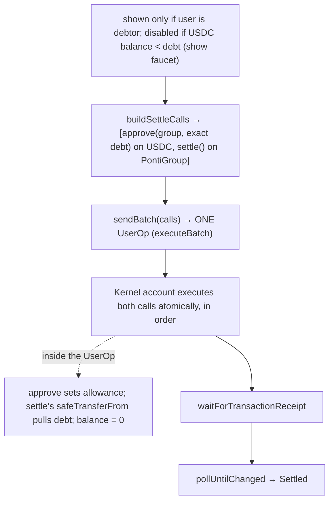
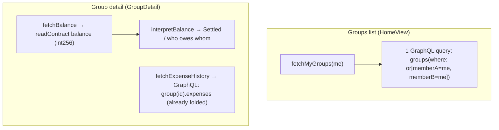
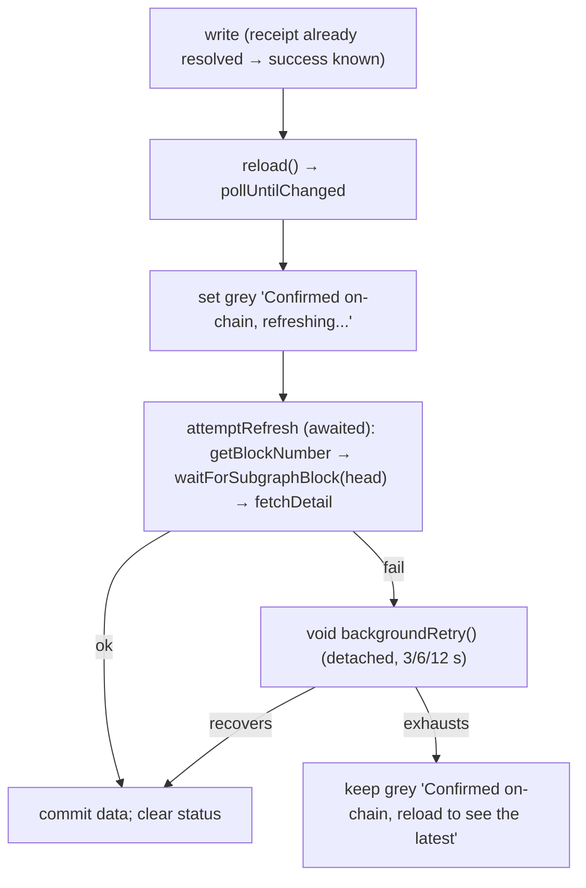
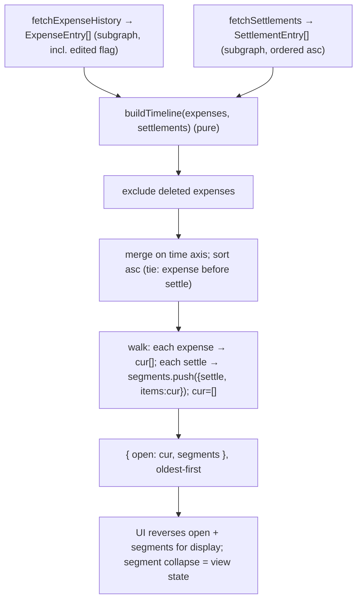

# Architecture

> **Purpose:** understand the system without reading its code. Each section answers one question
> you would otherwise have to read code to answer.
>
> | Section | Question it answers |
> |---|---|
> | 1. System context | What is this and what does it talk to? |
> | 2. Component map | What does each piece do? |
> | 3. Flows | How does a request or datum move through the system? |
> | 4. Decision log | Why is it built this way and not another? |

---

## 1. System context

Ponti is a non-custodial two-party expense-tracker and USDC settler. Two members record shared
expenses against a deployed `PontiGroup` contract; the contract holds the authoritative balance and
settles by routing USDC directly between wallets. The app layer makes this gasless and walletless
via account abstraction.

- **Writes** are gasless: the app builds a UserOperation, Privy signs it with the user's Kernel
  smart account, Pimlico's paymaster sponsors the gas and its bundler submits it.
- **Reads split by kind**: groups list and expense history come from the subgraph over GraphQL (cost
  scales with results, not block range). Balance (`int256`) and the debtor's USDC balance stay
  direct `readContract` calls; the chain head (`getBlockNumber`) is also read via RPC for the
  freshness gate.
- The contract is the source of truth; the subgraph is a read-only mirror that **trails** the
  chain head; the app holds only session and selected-group state.
- **No backend, device-local state only.** Counterparty nicknames live in `localStorage`; nothing
  is synced to a server. There is no off-chain data store.

---

## 2. Component map

### Contracts

| Box | Responsibility | Inputs | Outputs | Side effects | Verified |
|---|---|---|---|---|---|
| **PontiFactory** | Deploy a fresh `PontiGroup` for each `createGroup(counterparty)` call | `counterparty` address | `GroupCreated(group, memberA, memberB)` event | New `PontiGroup` deployed on-chain | ✅ unit+fuzz+invariant suite, deployed + verified on Basescan |
| **PontiGroup** | Track expenses + balance (`int256`) between two fixed members; settle in USDC | `addExpense`, `editExpense`, `deleteExpense`, `settle` calls | Events; `balance`, `expenses`, `memberA/B` public reads | Balance updated on every write; USDC transferred on `settle` | ✅ unit+fuzz+invariant suite, deployed + verified on Basescan |

#### PontiGroup: balance math invariant

`_signedContribution(payer, amount)` returns `+amount/2` if payer is memberA, `-amount/2` if
memberB. So `addExpense` increments `balance` by the contribution; `editExpense` subtracts the old
then adds the new; `deleteExpense` subtracts. `settle()` zeroes `balance` and calls
`safeTransferFrom(debtor, creditor, abs(balance))`. The int256 sign convention: positive = memberB
owes memberA; negative = memberA owes memberB.

#### PontiGroup: rescue escape-hatch

`rescueETH` / `rescueERC20` are an `onlyMember` escape-hatch that sends the contract's full
ETH/token balance to an arbitrary `to` address. This is NOT a custody break: the contract holds no
funds in normal operation (settle routes USDC directly wallet-to-wallet via `safeTransferFrom`;
only misdirected transfers accumulate as `balanceOf(this)`). The `to ∈ {memberA, memberB}`
constraint is deferred to the next contract revision.

### Indexer

| Box | Responsibility | Inputs | Outputs | Side effects | Verified |
|---|---|---|---|---|---|
| **Subgraph** | Index `GroupCreated` / `ExpenseAdded` / `ExpenseEdited` / `ExpenseDeleted` / `Settled` events into Group + Expense + Settlement entities; serve via GraphQL | Chain events | GraphQL endpoint (Group, Expense, Settlement entities; folded current state) | Entities written at index time; `edited` flag set on edit | ⚠️ deployed to Goldsky; no automated test gate |

The fold (applying add/edit/delete to current state) lives in the subgraph's mappings at index
time, not in client-side replay. `PontiGroup` instances are indexed via dynamic data-source
templates: the factory's `GroupCreated` event registers each new contract as a live template source.

#### Subgraph: Bytes filter casing

`Bytes` filters compare decoded bytes (hex-decode is case-insensitive), so checksummed filter
values also match. What does matter is on output: the subgraph returns lowercase addresses, so the
app `getAddress()`-checksums them for display parity.

### App layer: blockchain lib boxes

| Box | Responsibility | Inputs | Outputs | Side effects | Verified |
|---|---|---|---|---|---|
| **config.ts + generated/contracts.ts** | App constants + typed ABIs generated from `contracts/out` | (static build-time) | `CHAIN`, `FACTORY_ADDRESS`, `USDC_ADDRESS`, `RPC_URL`, `SUBGRAPH_URL`, `factoryAbi`, `groupAbi`, `usdcAbi` | None | ✅ used by all flows |
| **lib/client.ts** | Shared viem read client + `withRetry` helper (4 attempts, 300/600/1200 ms backoff) | (config) | `publicClient`, `withRetry` | None | ✅ exercised end-to-end |
| **lib/subgraph.ts** | `querySubgraph` (minimal `fetch` POST, no Apollo) + `waitForSubgraphBlock` freshness gate (polls `_meta` up to 8x, never throws; returns `boolean reached`) + `checkSubgraphHealth` (reads `_meta { block { number } hasIndexingErrors }` + `getBlockNumber` for head-lag; `HEAD_LAG_THRESHOLD = 25` blocks; never throws) | GraphQL query string, variables; `minBlock` | Typed data; `boolean reached`; `{degraded:boolean, reason:string\|null}` | None | ✅ exercised end-to-end |
| **lib write boxes** (createGroup, addExpense, editExpense, deleteExpense) | Encode + submit sponsored UserOps for each write; `createGroup` also parses `GroupCreated` receipt for new group address | `send`, group address (+ fields) | tx hash (+ resolved group address for `createGroup`) | Sponsored UserOp submitted; chain state updated | ✅ exercised end-to-end |
| **lib/settle.ts** | `buildSettleCalls` (encode `approve` + `settle` as a two-call array); `fetchUsdcBalance` (debtor's USDC balance) | group address, debt amount, smart account | call array `[{to,data}]`; USDC balance bigint | None (pure encode + one readContract) | ✅ exercised end-to-end |
| **lib read boxes** (fetchGroups.ts + fetchGroup.ts) | `fetchMyGroups`: one GraphQL `or`-filter query; `fetchBalance`/`fetchExpenseHistory`/`fetchSettlements`/`buildTimeline`/`fetchGroupMembers`/`interpretBalance`: balance+members via `readContract`, history+settlements via subgraph, timeline built pure, balance display derived. `ExpenseEntry` includes `edited` flag | smart account; group address | `GroupItem[]`; balance, `ExpenseEntry[]`, `SettlementEntry[]`, `Timeline`, `BalanceDisplay` | None | ✅ exercised end-to-end |
| **lib/homeBalances.ts** | Fan-out `fetchBalance` across all groups in parallel; flips sign viewer-relative (`isMemberA ? raw : -raw`); sums into `net` | `GroupItem[]`, `smartAccount: Address` | `HomeBalances { byGroup: Record<Address,bigint>, net: bigint }` | None | ✅ exercised end-to-end |
| **providers.tsx** | Wire Privy auth + SmartWallets (Kernel + Pimlico sponsorship) as React context | `children` | auth + smart-wallet context (sign + sponsored-send) | Privy session established | ✅ exercised end-to-end |
| **lib/inviteResolver.ts** | `resolveInvite(raw)`: validate a pasted raw address OR a `ponti.money/c/<address>` URL → checksummed `Address`, or `null` if invalid | raw string | `Address \| null` | None (pure) | ✅ typecheck + reviewed |
| **lib/identity.ts** | Device-local nickname store (`ponti.nicknames.v1` in localStorage) → `Identity { label, initial, tone, named }`; `named: boolean` discriminant; `setNickname` dispatches `IDENTITY_EVENT` so same-tab components re-render | `Address` | `Identity`; also `getNickname`/`setNickname` | `localStorage` read/write; dispatches `IDENTITY_EVENT` on write | ✅ exercised end-to-end |

### App layer / UI

The React/UI layer is a full-stack app with auth (SignIn, email OTP via Privy), home and group
detail screens, account management, a write-flow overlay system (FlowContext + FlowWidget), and a
desktop split-pane layout. It renders on a design-token foundation (`index.css @theme`).

All components own UI + state and reach chain/subgraph exclusively through the lib boxes above.
No component talks to the chain or subgraph directly.

The one point of blockchain relevance: `flow/FlowContext` fires the consent gate (confirm overlay)
**before** calling `send`, because Privy headless mode (`showWalletUIs: false`) removed Privy's
own transaction modals. Without the overlay, calling `send` fires the sponsored UserOp immediately
with no user gate.

### Box wiring

**Writes**: components → lib write boxes → the AA stack → chain (all sponsored):

**Reads**: components → lib read boxes, forking between the subgraph (lists / history) and
client → RPC (balance, USDC, head):

### GroupDetail: post-write staleness guardrails

Four mechanisms work together; they are coupled and must be read as a unit.

1. **`aliveRef` reset-on-mount.** A `useRef(true)` liveness flag guards detached async callbacks
   from calling `setState` after unmount. The flag is RESET to `true` on every mount. A `useRef`
   survives React's mount/unmount/remount cycle; setting it `false` only in cleanup leaves it
   permanently `false` after any remount, causing every subsequent async callback to short-circuit
   before committing state (stuck skeletons). The bug passes `tsc`; only a rendered pass catches it.

2. **Honest-gate (`reached`).** `waitForSubgraphBlock` returns `boolean reached` rather than
   `void`. `attemptRefresh` commits success only when `reached && !anyFailed`. A `void` return
   could not distinguish "subgraph caught up" from "8 polls exhausted"; the lock would clear
   optimistically and a stale list would show as fresh.

3. **Persisted marker + gated mount.** The block of the last confirmed write is persisted to
   `sessionStorage` keyed per group (`ponti:lastBlock:<addr>`). On mount/nav-back/reload, if the
   marker exists the initial read is gated on that block (skeletons until the subgraph reaches it).
   On reach the marker is cleared. The marker is written exclusively by the post-write path; the
   mount path only reads/clears. `sessionStorage` (not `localStorage`) because this is
   session-scoped freshness state.

4. **`isRefreshing` drives the action lock and status banner.** `isRefreshing = postWriteStatus !== null`
   is the single derived lock threaded as a prop to `ExpenseList` (edit/delete), `SettleSection`
   (settle), and the Add-expense button. A single banner lives in the action zone with two
   sub-states: `updating` (spinner + "catching up") and `exhausted` ("the list's a step behind.
   Reload to confirm." + Reload CTA).

#### Data-freshness detection

Two complementary failure modes, two signals:

- **`hasIndexingErrors: true`**: a mapping crash halted indexing. The indexer knows it failed.
- **Head-lag > `HEAD_LAG_THRESHOLD` (25) blocks**: the indexer is alive but frozen. A live outage
  stalls with `hasIndexingErrors: false`, so only the head-lag signal catches it.
  (`HEAD_LAG_THRESHOLD = 25` is approximately 50 s on Base Sepolia, generous enough that healthy
  single-digit lag never false-fires.)

Chain head comes from `getBlockNumber` (RPC); indexer head from `_meta.block.number` (GraphQL).
`checkSubgraphHealth` is a single direct `fetch` (no retry), never throws (fail-safe: returns
`{degraded:false, reason:null}` on any error).

`subgraphDegraded` drives ONLY the `FreshnessBanner`, never `isRefreshing`, so actions are never
locked. The outage can be indefinite (locking would trap the user; the contract is the source of
truth and balance is always fresh via `readContract`). The post-write banner takes precedence via
the `!isRefreshing` gate; both banners never show simultaneously.

---

## 3. Flows

### Gasless write (shared pattern: create / add / edit / delete)

Every single-call write follows the same shape; only the target contract + function change.
(Settle is the one multi-call flow, covered in its own diagram.)

Every write goes through `flow.start()` so consent fires before the UserOp is submitted. `send`
and `sendBatch` adapters are derived once in `App.tsx` from Privy's client and passed down as
props, so no component depends on Privy's concrete type. `send` takes one `{to,data}`;
`sendBatch` takes a `calls[]` array (used only by settle).

Error recovery in the write-flow controller branches on whether a tx hash exists at the point of
failure:

- **`submitFailed=true`**: `submit()` threw before returning a hash; nothing reached the chain.
  "Try again" re-runs the full submit+receipt sequence; always safe to re-send.
- **`submitFailed=false`**: `submit()` returned a hash (write IS on-chain) but
  `waitForTransactionReceipt` failed afterward. "Try again" re-awaits the receipt using the
  known hash and **never re-sends**. Dismiss/cancel still fire `onComplete` so the confirmed
  write is not left unrefreshed.

### Settle (one batched UserOp)

One UserOp, not two transactions. Batching `approve` + `settle` into a single `executeBatch`
makes them atomic: the allowance exists when `settle()`'s `transferFrom` runs, so the cross-node
"approve mined but bundler simulated settle against a lagging node → exceeds allowance" race is
structurally impossible.

The `approve` is exact-debt: `approve(group, abs(balance))`, not an unbounded allowance. The
debtor-only gate is enforced on-chain in `settle()`.

### Read (balance + history)

Two kinds of read: a **state read** (`balance`, one `readContract`, O(1)) and a **list read**
served by the subgraph over GraphQL (cost scales with results, not block range). The fold (apply
add/edit/delete to current state) lives in the subgraph's mappings at index time, not in
client-side replay.

Balance intentionally stays off the subgraph. Computing balance there would re-implement contract
math and create a drift risk. The `int256` from `readContract` is authoritative.

### Write-then-read cycle (resilient post-write refresh)

A write only shows up after it is mined AND the subgraph has indexed past that block. The subgraph
trails the chain head, so the refresh is gated on block number and tolerant of a transient
subgraph outage. A refresh failure must never look like a write failure.

Key properties: `fetchDetail` uses `Promise.allSettled` (one failing read never blanks the
others); the first attempt is awaited so the write form reverts promptly; retries run detached so
the form never hangs; `detailError` (red) is reserved for cold-load failures only.

### Home net balance (readContract fan-out)

The subgraph serves no per-group balance field. Home net = N `readContract` calls fanned out
across all groups in parallel, each flipped viewer-relative (`isMemberA ? raw : -raw`), then
summed client-side. `Promise.all`: if any call throws, HomeView shows the error state; the
individual `byGroup` entries power each group row.

### Timeline build

The tie-break (expense before settle on equal timestamps) ensures a same-block expense belongs to
the segment that settlement closes, not the one it opens. `buildTimeline` is a pure function.

---

## 4. Decision log

The blockchain and trust decisions are given full treatment; frontend/UX decisions are condensed
at the end.

| # | Date | Decision | Why | Rejected alternative |
|---|---|---|---|---|
| 1 | 2026-05 | Contract-first; non-custodial router; debtor-only settle; per-group factory; USDC-native; soft delete; single `int256` balance; optimistic trust | The contract is the source of truth; off-chain layers are plumbing. Each sub-decision enforces a specific trust property (see notes below) | Off-chain balance; custodial settlement; shared contract with groupId mapping |
| 2 | 2026-05 | App layer = ERC-4337 AA: Privy (auth + embedded Kernel account) + Pimlico (bundler + paymaster) + viem; no wagmi | Gasless, walletless onboarding without any contract changes | EOA + wallet extension; wagmi hooks |
| 3 | 2026-06-03 | The Graph subgraph for lists/history; balance stays `readContract` | Free-RPC full-history `getLogs` is unsustainable (caps/timeouts; cost grows with chain forever). Balance stays on-chain: computing it in the subgraph re-implements contract math and creates a drift risk | Stay on chunked `getLogs` stopgap; balance in subgraph |
| 4 | 2026-06-04 | Settle = ONE batched UserOp (`approve` + `settle` via `executeBatch`) | Atomic: eliminates the cross-node "exceeds allowance" race structurally. The allowance exists when `settle()`'s `transferFrom` runs | Two sequential sponsored txs |
| 5 | 2026-06-04 | Resilient post-write refresh (`Promise.allSettled` + grey reassurance + awaited-first / detached retry) | A refresh failure must never look like a write failure; conflating the two caused a duplicate re-add bug | Single awaited refresh; red error on failure |
| 6 | 2026-06-05 | Contracts immutable, no proxy; the factory IS the upgrade path | An upgrade admin able to rewrite `settle()` breaks the non-custodial trust model. A proxy makes audits harder and bounded-risk/cheap-audit harder to argue | Upgradeable proxy |
| 7 | 2026-06-10 | Privy headless (`showWalletUIs: false`) + own consent gate via FlowWidget | The app owns the write-flow UX; Privy's stacked modals break it. Headless mode means calling `send` fires the UserOp immediately with no gate, so the app MUST present its own consent step before submit | Theming Privy's modals |
| 8 | 2026-06-10 | Invite = address-as-token, serverless (`/c/<address>`); email-to-address lookup deferred | No backend exists; short opaque tokens need one | Backend token service |
| 9 | 2026-06-15 | App-level write-flow controller (FlowProvider/useFlow + one FlowWidget); `PendingFlow.submit` returns the tx hash only; error recovery branches on whether a hash exists | The submit/receipt split is the only way to avoid the duplicate-write trap: if a hash exists, "retry" re-awaits the receipt, never re-sends | Component-local controller; submit-owns-receipt |
| 10 | 2026-06-15 | Timeline reads extended additively: `fetchSettlements` + `edited` field on expense query; pure `buildTimeline` merges both streams | The subgraph already indexed Settlement entities. `buildTimeline` is pure and trivially testable | Server-side timeline computation |
| 11 | 2026-06-22 | Desktop master-detail (>=1024px): URL stays the selection source in both layouts | URL-as-selection keeps deep-linking + back/forward working in both layouts without duplicating routing logic | Per-layout duplicate routing |
| 12 | 2026-06-23 | Read/write staleness guardrails: single `isRefreshing` action lock; `sessionStorage` gated mount on nav-back; `waitForSubgraphBlock` returns `boolean reached` | Split freshness: `readContract` balance is always fresh, subgraph list trails; nav-back re-read without gating showed stale data; `void` gate could not distinguish reached from exhausted | Bare reload on nav-back; `void` gate; optimistic lock-clear |
| 13 | 2026-06-24 | Data-freshness indicator: two complementary signals (`hasIndexingErrors` + head-lag > 25 blocks); inform, never lock | `hasIndexingErrors` catches a mapping crash; head-lag catches a frozen indexer where `hasIndexingErrors` stays false (the live outage pattern). Inform-not-lock: an external outage can be indefinite; locking traps the user while balance is always fresh via `readContract` | Locking like the post-write guardrail; naive `subgraphBlock < head` (false-fires on healthy lag) |
| 14 | 2026-06-25 | `rescueETH`/`rescueERC20` accept an arbitrary `to` address (current version); `to ∈ {memberA, memberB}` constraint deferred to the next contract revision | Not a custody break: the contract holds no funds in normal operation; `balanceOf(this)` reads only misdirected funds. Deferring avoids a redeploy cycle for a low-risk edge case on testnet | Constraining `to` now (requires redeploy) |

#### Decision 1 expanded: contract trust sub-decisions

- **Non-custodial router.** `settle()` calls `safeTransferFrom(debtor, creditor, amount)`; the
  contract never holds USDC. Settlement is a routing operation, not a withdrawal.
- **Debtor-only settle.** `msg.sender == debtor` is enforced on-chain. Technically either party
  could pull via the allowance; restricting to the debtor matches user expectations around consent.
  This restriction is reversible; the reverse is not.
- **Per-group factory pattern.** `PontiFactory` deploys a fresh `PontiGroup` per `createGroup`
  call. Both members are `immutable` constructor args. No `groupId` parameters, no nested mappings.
  Multiple groups per pair are allowed (different purposes, e.g., "apartment" vs "trips").
- **Single `int256` balance.** Positive = memberB owes memberA; negative = memberA owes memberB.
  Splitting into two fields would require keeping them consistent; a single signed integer is the
  only field that needs updating.
- **Soft delete.** `deleteExpense` sets `deleted = true` on the struct and subtracts the
  contribution from balance. The expense record is preserved; the audit trail is part of the
  product.
- **Optimistic trust.** Either member can post any expense; it hits the balance immediately. No
  confirmation or dispute mechanism. This matches the two-party trust model.
- **Immutable members.** `memberA` and `memberB` are set in the constructor and cannot change.
  Access control is `msg.sender == memberA || msg.sender == memberB`.

#### Frontend and UX decisions (condensed)

- Design tokens in `index.css @theme` as single source of truth; ad-hoc arbitrary values banned.
- Radix Dialog only for overlays (focus trap, escape, scroll lock). No full component library.
- Write-flow form folds into the FlowWidget sheet as a leading `input` phase (one continuous surface,
  no sheet-on-sheet).
- `DrawLine` (directional sweep) reserved for settle only; other actions use non-directional
  animations so motion never implies a transfer that did not happen.
- `Identity.named: boolean` discriminant prevents address leakage in unnamed counterparty display.
- `sessionStorage` for post-write block markers (session-scoped freshness, not durable user data).
